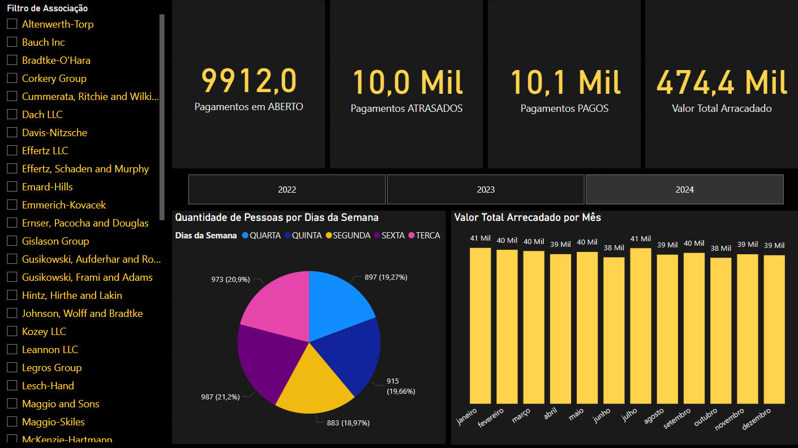

# Dashboard

## Configuração do Power BI

O arquivo já vem pré configurado para rodar localmente com o banco puxando do docker.

A conexão com o banco se faz por meio do Driver ODBC, caso não tenha instalado na maquina, precisa fazer o download.

Após a instalação do driver, quando abrir o arquivo no Power BI e tentar atualizar os dados, o mesmo irá solicitar a conexão com o banco, onde o usuario padrão é postgres e a senha padrão é postgres. Caso possua um usuario postgres já cadastrado na maquina com informações diferentes, utilizar o da maquina.

## Execução do Dashboard

Após a execução completa da pipeline, pode-se abrir o arquivo no Power BI desktop e ir manualmente na consulta para atualizar o dados.

O dashboard estará com os dados atualizados e pronto para realizar as análises.

## Informações do Dashboard

O dashboard foi feito pensado em facilitar a tomada de decisão da presidência de cada associação, com 4 KPI's e 2 métricas.

 - KPI's: Quantidade de pagamentos em aberto, atrasados e pagos e o valor total arrecadado.

 - Métricas: Quantidade de pessoas por dias da semana e Valor arrecadado por mês.

 - Filtros: Associação e período (Ano).

### Exemplo de Visualização:

 

