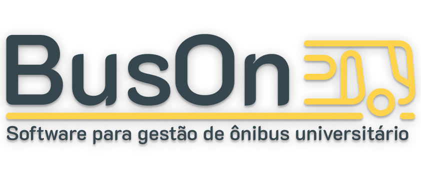

<!--  -->

{.logo-img-dark}
{.logo-img-light}

- Buson App é um aplicativo desenvolvido para facilitar o gerenciamento dos pagamentos mensais dos acadêmicos que utilizam o serviço de transporte para deslocamento até as universidades. Além disso, o aplicativo fornece informações detalhadas sobre a associação, situação dos acadêmicos e seus pagamentos por meio de um chat com inteligência artificial.

### Modelo Relacional Buson App

- **Associação** 
    - Tabela contém os dados de associações.
- **Instituição**
    - Tabela contém os dados de instituições de ensino.
- **Curso**
    - Tabela contém os dados de cursos por instituição.
- **Usuário**
    - Tabela contém os dados de usuários, e cada usuário tem um curso, uma instituição e associação.
- **Pagamento**
    - Tabela contém os dados de pagamentos de usuários.
- **Parametro**
    - Tabela contém os parâmetros para aplicação, por exemplo valores de mensalidades, dia de vencimento, etc.

### Sobre o Buson Delta Lake

- O projeto Buson Delta Lake se baseia em um banco de dados relacional criado na matéria de IA do Buson App, sendo utilizado como base para criar uma grande massa de dados e fazer uma ingestão de dados usando o modelo Medalhão. O objetivo final é visualizar os dados em um BI.